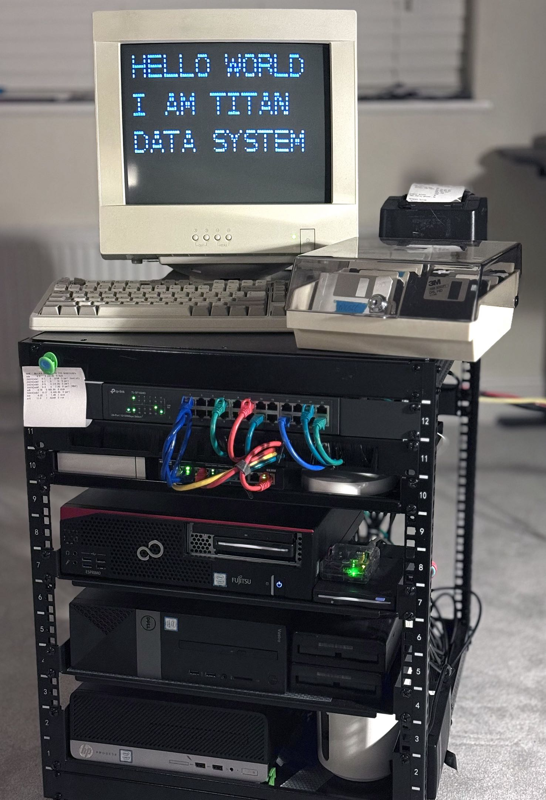
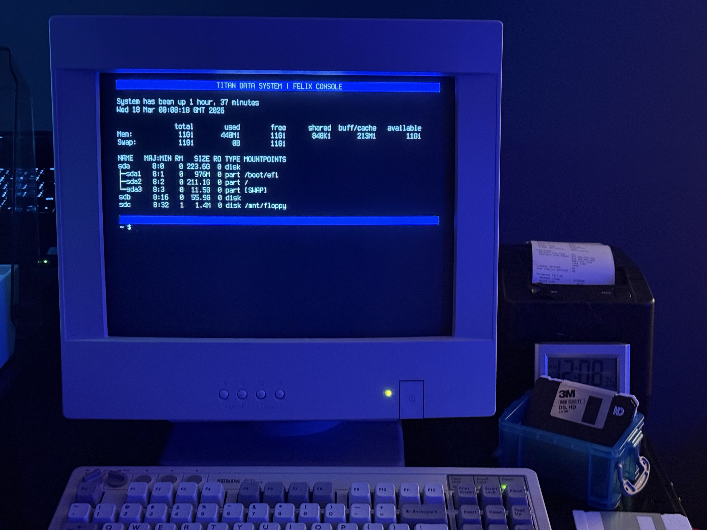

# FELIX Console

Felix is a debian linux rice aimed for a late 80s single user UNIX system feel,
and is used as my part of the console on my home lab.

> **WARNING**
> This WILL REMOVE your default getty and PAM authentication on ttys 1-5, and replace it with a custom getty.

*For clarity, TITAN DATA SYSTEM is the proper name for the home lab, and FELIX is the name of the console system running on it.*

## Installation

Run the `install.sh` script in this repo which will install the necessary files into your root directory.